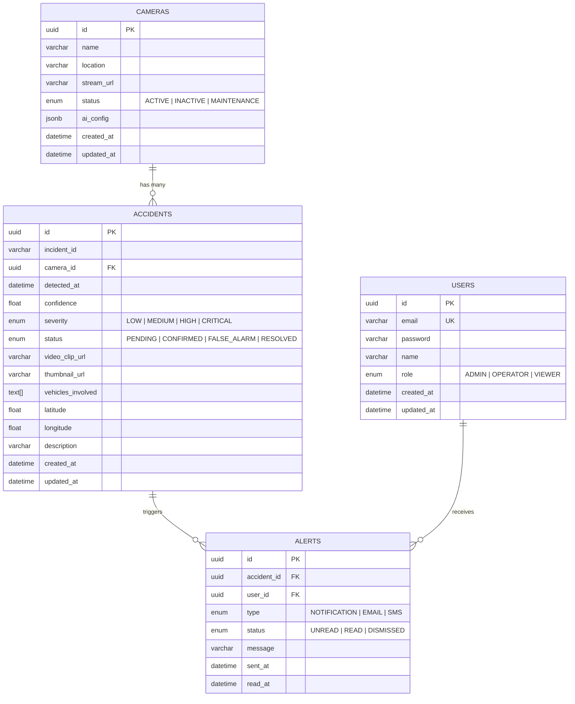
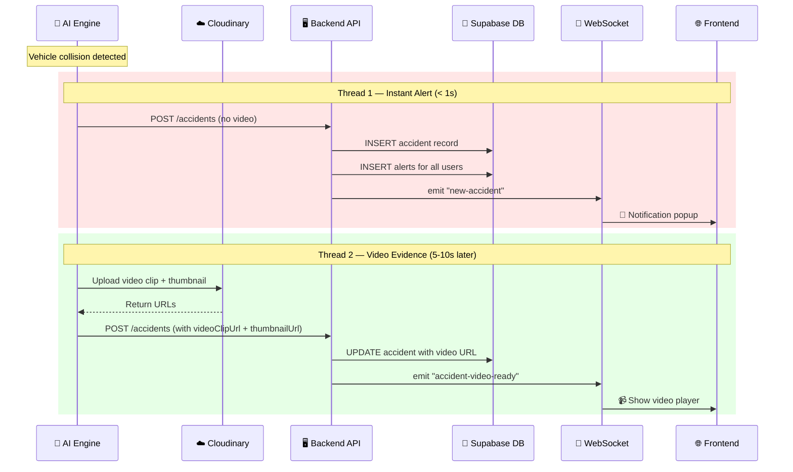
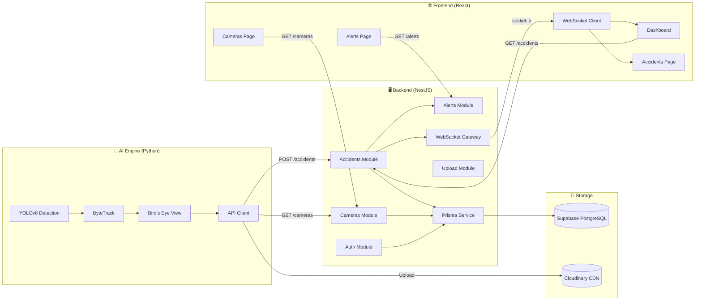
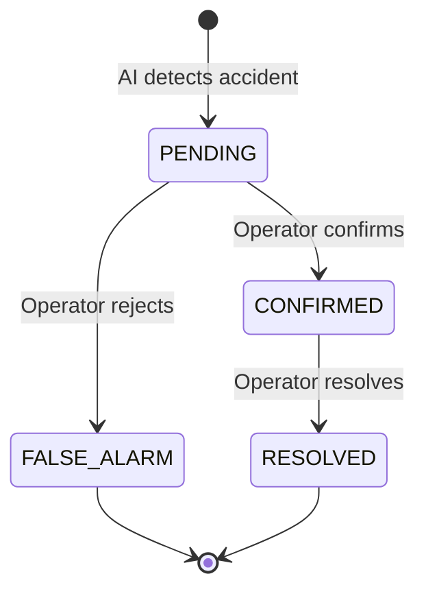
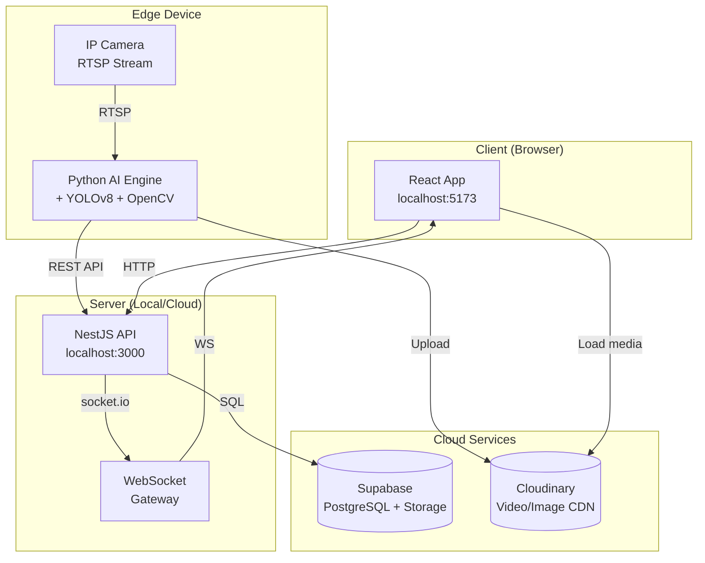
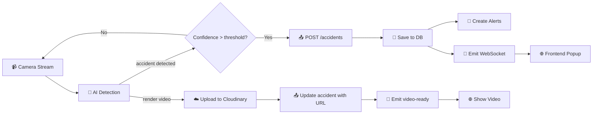

# System Diagrams

## 1. Use Case Diagram

```mermaid
graph TB
    subgraph Actors
        Admin[🧑‍💼 Admin]
        Operator[👷 Operator]
        AI[🤖 AI Engine]
    end

    subgraph System["🚨 Accident Detection System"]
        UC1[Login / Register]
        UC2[Manage Users]
        UC3[Manage Cameras]
        UC4[Configure AI Calibration]
        UC5[View Dashboard]
        UC6[View Accidents]
        UC7[Update Accident Status]
        UC8[View Alerts]
        UC9[Mark Alert as Read]
        UC10[Detect Accident]
        UC11[Report Accident via API]
        UC12[Upload Video Evidence]
        UC13[Receive Real-time Notification]
    end

    Admin --> UC1
    Admin --> UC2
    Admin --> UC3
    Admin --> UC4
    Admin --> UC5
    Admin --> UC6
    Admin --> UC7
    Admin --> UC8
    Admin --> UC9
    Admin --> UC13

    Operator --> UC1
    Operator --> UC5
    Operator --> UC6
    Operator --> UC7
    Operator --> UC8
    Operator --> UC9
    Operator --> UC13

    AI --> UC10
    AI --> UC11
    AI --> UC12
```

---

## 2. ERD (Entity Relationship Diagram)

---

## 3. Sequence Diagram — Accident Detection Flow

---

## 4. System Architecture Diagram

---

## 5. State Diagram — Accident Lifecycle

---

## 6. Deployment Diagram

---

## 7. Data Flow Diagram

